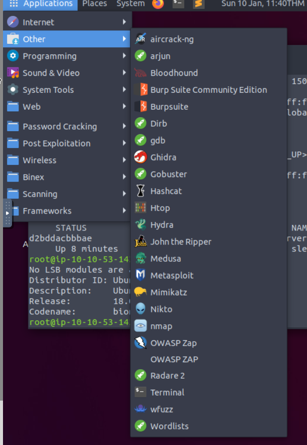

# TryHackMe Intro

## [Kali gitlab](https://gitlab.com/kalilinux/)

## == Starter Rooms ==

### Room: [OpenVPN](https://tryhackme.com/room/openvpn)

Connectiong to tryhackme.com vpn

```sh
sudo apt install openvpn
sudo openvpn /path-to-file/file-name.ovpn
```

MY CONNECTION (mrwolfyu)

```sh
sudo openvpn $HOME/Documents/CTF-ROOT/mrwolfyu.ovpn
```

#### Task 6

answer: flag{connection_verified}

### Room: [Tutorial](https://tryhackme.com/room/tutorial)

#### Task 1: Deploy your first machine

```sh
Answer: flag{connection_verified}
```

Attack Box limited to 1 hour per day.

Apps in Attack Box:


### Room: [Starting Out In Cyber Sec](https://tryhackme.com/room/startingoutincybersec)

#### Task 1: Intro

no answer

#### Task 2: Offensive Security

TODO:

* [x] [Metasploit](https://tryhackme.com/room/rpmetasploit)
* [ ] [Blue](https://tryhackme.com/room/blue)
* [ ] Other Rooms
  
```sh
Answer: penetration tester
```

#### Task 3: Defensive Security

TODO Only:

* [ ] [Detect Attacks Using Splunk](https://tryhackme.com/room/bpsplunk)
* [ ] [Analyse Memory To Trace An Attackers Actions Using Volatility](https://tryhackme.com/room/bpvolatility)
* [ ] [Introduction To Malware Analysis](https://tryhackme.com/room/malmalintroductory)
* [ ] [Researching and Identifying Malware](https://tryhackme.com/room/malresearching)
* [ ] Subs: Identifying Strings In Malicious Applications

```sh
Answer: Security Analyst
```

## == TOOLS ==

* netcat
* nmap
* [pwncat](https://github.com/cytopia/pwncat[])
* [BurpSuite Community](https://portswigger.net/burp/communitydownload)
* vscode
* [MD cheatsheet](https://github.com/adam-p/markdown-here/wiki/Markdown-Cheatsheet)